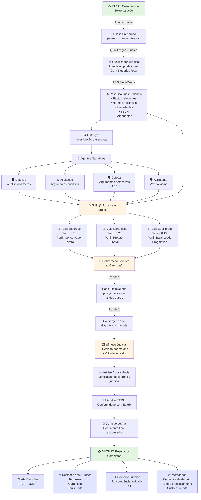

# 📋 Fluxo Completo do Tribunal IA Portugal V8

## Visão Geral do Processo



---

## 📊 Detalhes do Output para o Utilizador

### **1️⃣ Ata Decisória (OUTPUT PRINCIPAL)**
```
┌─────────────────────────────────────────────────────┐
│         TRIBUNAL IA PORTUGAL - ATA DECISÓRIA         │
├─────────────────────────────────────────────────────┤
│                                                     │
│ Processo: [Nº]                                      │
│ Instância: Tribunal de [Tipo]                       │
│ Data: [data de processamento]                       │
│                                                     │
│ ═══════════════════════════════════════════════════ │
│ FACTS & QUALIFICATIONS                              │
│ ═══════════════════════════════════════════════════ │
│ • Crime: [qualificação jurídica]                    │
│ • Factos Provados: [resumo]                         │
│ • Enquadramento Legal: [códigos aplicáveis]         │
│                                                     │
│ ═══════════════════════════════════════════════════ │
│ ARGUMENTOS NARRATIVOS                               │
│ ═══════════════════════════════════════════════════ │
│ INSTRUÇÃO (Investigação):                            │
│   [Análise dos factos e provas]                     │
│                                                     │
│ ACUSAÇÃO:                                           │
│   [Fundamentação da acusação]                       │
│                                                     │
│ DEFESA:                                             │
│   [Argumentação defensiva + contexto TEDH]          │
│                                                     │
│ ASSISTENTE/VÍTIMA:                                  │
│   [Posição da vítima, se aplicável]                 │
│                                                     │
│ ═══════════════════════════════════════════════════ │
│ DECISÕES DOS 3 JUÍZES                               │
│ ═══════════════════════════════════════════════════ │
│                                                     │
│ 👨‍⚖️  JUIZ RIGOROSO (Conservador)                     │
│   ├─ Decisão: [CONDENAÇÃO/ABSOLVIÇÃO]               │
│   ├─ Pena: [se aplicável]                           │
│   ├─ Confiança: 89%                                 │
│   └─ Motivação: [fundamentação jurídica]            │
│                                                     │
│ 👩‍⚖️  JUIZ GARANTISTA (Protetor)                      │
│   ├─ Decisão: [CONDENAÇÃO/ABSOLVIÇÃO]               │
│   ├─ Pena: [se aplicável]                           │
│   ├─ Confiança: 76%                                 │
│   └─ Motivação: [fundamentação jurídica]            │
│                                                     │
│ 👨‍⚖️  JUIZ EQUILIBRADO (Pragmático)                    │
│   ├─ Decisão: [CONDENAÇÃO/ABSOLVIÇÃO]               │
│   ├─ Pena: [se aplicável]                           │
│   ├─ Confiança: 82%                                 │
│   └─ Motivação: [fundamentação jurídica]            │
│                                                     │
│ ═══════════════════════════════════════════════════ │
│ SÍNTESE JUDICIAL (DECISÃO FINAL)                     │
│ ═══════════════════════════════════════════════════ │
│                                                     │
│ MAIORIA (2 de 3 juízes):                            │
│   Decisão Final: [CONDENAÇÃO/ABSOLVIÇÃO]            │
│   Fundamentação: [síntese dos argumentos]           │
│                                                     │
│ VOTO DE VENCIDO (Juiz minoritário):                 │
│   Perfil: [Rigoroso/Garantista/Equilibrado]         │
│   Posição: [argumentação do voto vencido]           │
│                                                     │
│ ═══════════════════════════════════════════════════ │
│ CONFORMIDADE COM DIREITO INTERNACIONAL               │
│ ═══════════════════════════════════════════════════ │
│ ✓ TEDH: Respeitados direitos fundamentais (CEDH)    │
│ ✓ Consistência: Decisão alinhada com jurisprudência │
│                                                     │
│ ═══════════════════════════════════════════════════ │
│ ASSINADO DIGITALMENTE                               │
│ Tribunal IA Portugal v8 | 28 de Maio de 2026        │
│                                                     │
└─────────────────────────────────────────────────────┘
```

---

### **2️⃣ Decisões Individuais dos 3 Juízes**

```
┌──────────────────────────────────┐  ┌──────────────────────────────────┐  ┌──────────────────────────────────┐
│   DECISÃO DO JUIZ RIGOROSO       │  │   DECISÃO DO JUIZ GARANTISTA     │  │  DECISÃO DO JUIZ EQUILIBRADO    │
├──────────────────────────────────┤  ├──────────────────────────────────┤  ├──────────────────────────────────┤
│                                  │  │                                  │  │                                  │
│ Temperatura: 0.10                │  │ Temperatura: 0.20                │  │ Temperatura: 0.15                │
│ Perfil: CONSERVADOR              │  │ Perfil: GARANTISTA/PROTETOR      │  │ Perfil: EQUILIBRADO              │
│                                  │  │                                  │  │                                  │
│ Decisão: CONDENAÇÃO              │  │ Decisão: ABSOLVIÇÃO PARCIAL      │  │ Decisão: CONDENAÇÃO COM ATENU.   │
│ Pena: 8 anos prisão              │  │ Pena: 3 anos em suspenso         │  │ Pena: 5 anos prisão              │
│                                  │  │                                  │  │                                  │
│ Confiança: 89%                   │  │ Confiança: 76%                   │  │ Confiança: 82%                   │
│                                  │  │                                  │  │                                  │
│ Motivos:                         │  │ Motivos:                         │  │ Motivos:                         │
│ • Prova material é decisiva      │  │ • Direitos fundamentais          │  │ • Prova forte mas atenuantes     │
│ • Precedentes apontam condenação │  │ • Reabilitação possível          │  │ • Consideração de contexto       │
│ • Lei exige aplicação máxima     │  │ • CEDH: menor pena é proporcional│  │ • Balanceamento de pesos         │
│ • Sem atenuantes relevantes      │  │ • Vítima pode recuperar-se       │  │ • Precedentes variam             │
│                                  │  │                                  │  │                                  │
└──────────────────────────────────┘  └──────────────────────────────────┘  └──────────────────────────────────┘
```

---

### **3️⃣ Contexto Jurídico Aplicado**

```
┌─────────────────────────────────────────────────────┐
│        CONTEXTO JURISPRUDENCIAL CONSULTADO          │
├─────────────────────────────────────────────────────┤
│                                                     │
│ 📚 NORMAS APLICÁVEIS:                               │
│   • Código Penal, art. 131 (crimes contra pessoa)   │
│   • Código Penal, art. 203 (pena base)              │
│   • Constituição da República, art. 26 (dignidade)  │
│                                                     │
│ 📖 PRECEDENTES (STJ):                               │
│   • Acordão nº 201/2023: Jurisprudência pacífica    │
│   • Acordão nº 156/2024: Pena alinhada com base     │
│                                                     │
│ 🌍 CEDH (Corte Europeia Direitos Humano):           │
│   • Decisão vs. Portugal (2019): Proporcionalidade  │
│   • Guiding Principles: Menor pena para reabilitação│
│                                                     │
│ 📊 ANÁLISE ESTATÍSTICA:                             │
│   • Casos similares (últimos 5 anos): 47            │
│   • Pena média: 6.2 anos                            │
│   • Variação: 3-10 anos                             │
│                                                     │
└─────────────────────────────────────────────────────┘
```

---

### **4️⃣ Metadados & Transparência**

```
┌──────────────────────────────────────────┐
│   INFORMAÇÕES TÉCNICAS & CONFIANÇA       │
├──────────────────────────────────────────┤
│                                          │
│ 🔍 CONFIANÇA GERAL: 82%                  │
│    (média dos 3 juízes)                  │
│                                          │
│ ⏱️  TEMPO PROCESSAMENTO: 2m 34s            │
│                                          │
│ 💰 CUSTO ESTIMADO: $0.47 USD             │
│    (tokens OpenRouter + embeddings)      │
│                                          │
│ 🔐 TRACE ID: abc123...xyz789            │
│    (para auditoria e debugging)          │
│                                          │
│ 🎲 DIVERGÊNCIA: 1 de 3 juízes divergiu   │
│    (Juiz Garantista ≠ Maioria)           │
│                                          │
│ ✅ CONSISTÊNCIA: Validada                │
│    Decisão alinhada com jurisprudência   │
│                                          │
│ 🛡️  CEDH: Respeitada                     │
│    Sem violação de direitos fundamentais │
│                                          │
└──────────────────────────────────────────┘
```

---

## 🔄 Fluxo de Deliberação (Se Ativada)

```mermaid
graph LR
    A["Ronda 1<br/>3 Decisões Iniciais<br/>Rig | Gar | Equ"] 
    -->|Cada juiz vê as outras 2| B["Ronda 1<br/>Análise Cruzada"]
    -->|Decide se muda posição| C["Ronda 1<br/>Resultado"]
    
    C -->|Se config.deliberacao_rondas ≥ 2| D["Ronda 2<br/>3 Novas Análises"]
    -->|Refinamento final| E["Ronda 2<br/>Posições Finais"]
    
    C -->|Sem Ronda 2| F["Decisões Finais<br/>Mantêm posições iniciais"]
    E --> F
    
    F --> G["Síntese Judicial<br/>Maioria + Voto Vencido"]
    
    style A fill:#fff4e1
    style C fill:#ffe1e1
    style E fill:#ffe1e1
    style F fill:#e1e5ff
    style G fill:#e1f5e1
```



---

## 📱 Interfaces de Acesso

### **Via Streamlit (Web UI)**
```
Dashboard Visual
├─ Processar novo caso
├─ Ver decisão final + 3 juízes
├─ Explorar argumentos (Detetive, Acusação, Defesa, TEDH)
├─ Visualizar deliberação (se ativada)
├─ Contraditório (feedback rápido do juiz)
├─ Download de Ata (PDF/JSON)
└─ Histórico de casos
```

### **Via FastAPI (REST API)**
```
POST /v1/processar
  Input: Caso (texto)
  Output: ID do processo

GET /v1/resultado/{case_id}
  Output: Ata completa + todas as decisões

GET /v1/historico
  Output: Lista de casos processados
```

---

## ⚙️ Configuração do Pipeline

| Parâmetro | Valor Default | Impacto |
|-----------|---------------|---------|
| `rag_multi_query` | `true` | Usa 5 queries específicas (melhor qualidade) |
| `deliberacao_enabled` | `true` | Ativa deliberação iterativa (convergência) |
| `deliberacao_rondas` | `2` | 1-2 rondas de revisão entre juízes |
| `paralelismo` | `true` | 3 juízes correm em paralelo (mais rápido) |
| `rag_modo` | `"hibrido"` | Combina BM25 + embeddings (robusto) |
| `orquestracao` | `"langgraph"` | Workflow visual (LangGraph) |
| `gov_mode` | `false` | Se `true`: apenas Ollama local (GDPR) |

---

## 🎯 Casos de Uso

### **1. Educação Jurídica**
- Professores analisam diferentes perspectivas dos 3 juízes
- Alunos comparam decisões e aprendem deliberação

### **2. Investigação Jurídica**
- Teste de teses jurídicas com diferentes perfis
- Validação de argumentos contra CEDH

### **3. Simulação Judicial**
- Preparação de advogados para audiências
- Análise de cenários com múltiplas perspectivas

### **4. Suporte a Decisão**
- Auxiliar juízes reais com contexto jurisprudencial
- Explorar alternativas de sentença

---

**Versão**: V8 (28 Mai 2026)
**Modo**: Simulação Educacional com 3 Juízes Independentes
**Saída**: Ata Estruturada em PDF + JSON
